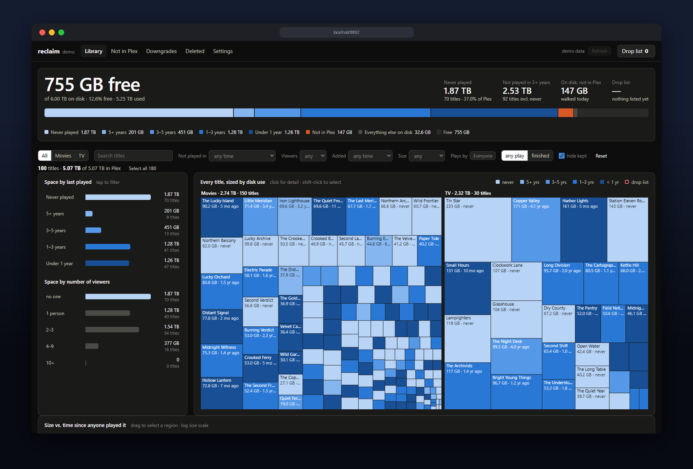
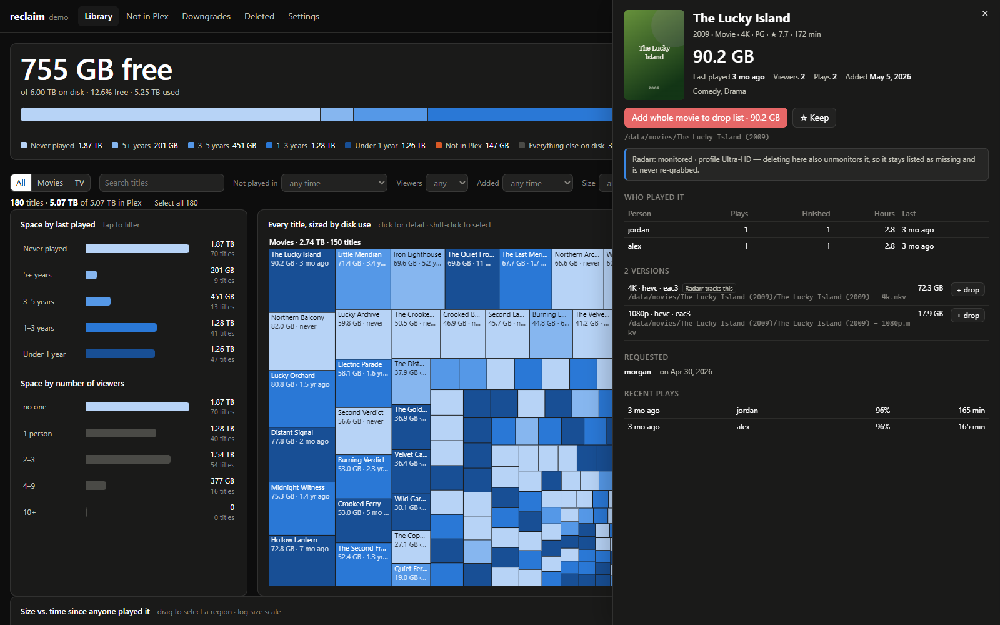
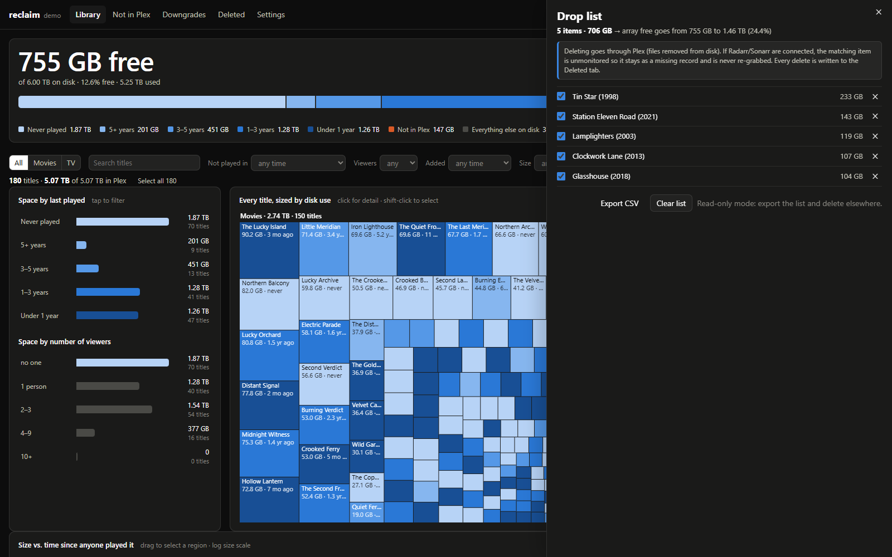
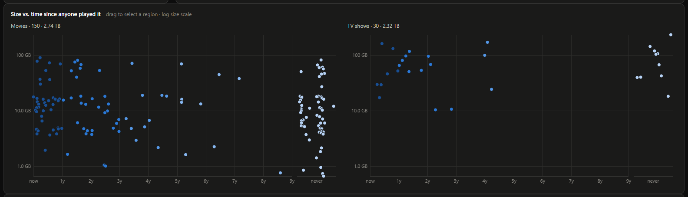
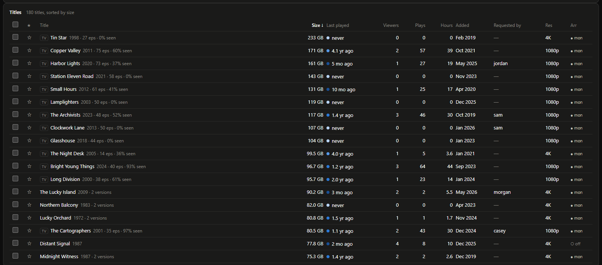
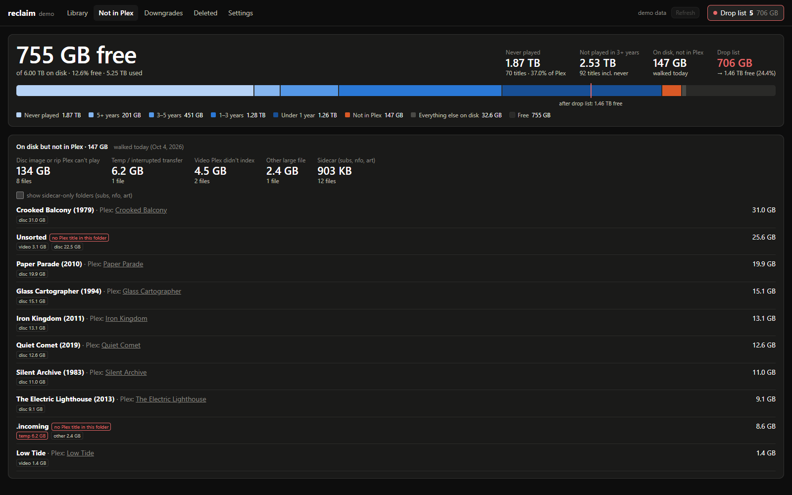
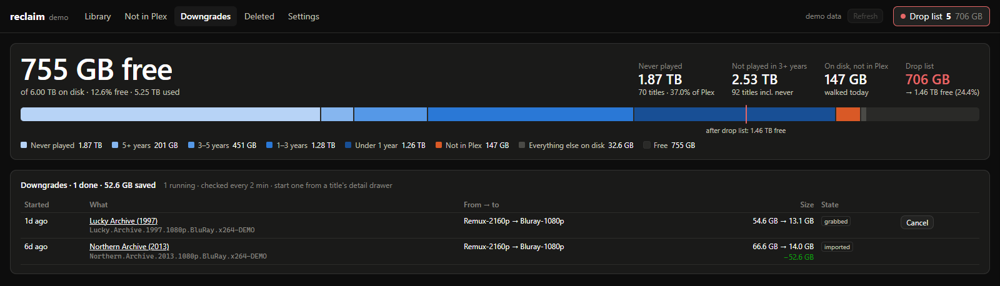
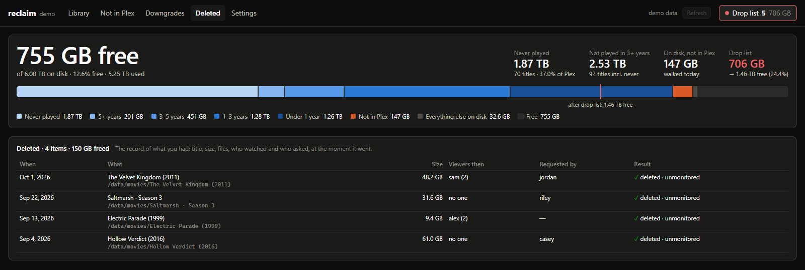
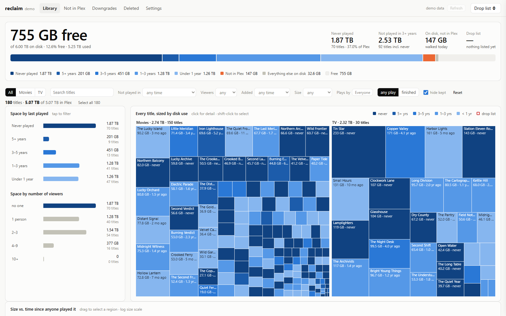

# Reclaim

**See where your Plex server's disk space goes, decide what to let go, and get the space back.**



Reclaim lines up Plex's library and your watch history against bytes on disk: what takes the space,
when anyone last played it, how many people watched it, and who asked for it. When you've decided, it
deletes through Plex and unmonitors the title in Radarr or Sonarr so it isn't downloaded again. Or it
asks Radarr or Sonarr for a smaller release and swaps it in.

It runs on your own network, talks only to your own services, and has no accounts or telemetry.

<table>
<tr>
<td width="50%"><br>
<sub><b>Every title in detail.</b> Who played it and how much, each version and file, what Radarr or Sonarr thinks of it, who requested it.</sub></td>
<td width="50%"><br>
<sub><b>A drop list.</b> Shortlist titles, seasons or single versions and see the free space add up before anything is deleted.</sub></td>
</tr>
<tr>
<td><br>
<sub><b>Size against time since anyone played it.</b> Big and forgotten sits top right. Drag to select a region.</sub></td>
<td><br>
<sub><b>The whole library as a table.</b> Sort and filter by size, last play, viewers, plays, requester, resolution and *arr status.</sub></td>
</tr>
<tr>
<td><br>
<sub><b>Files Plex doesn't index.</b> Disc images, interrupted transfers, unmatched video and sidecars, found by walking the disk.</sub></td>
<td><br>
<sub><b>Downgrades.</b> Swap a 4K remux for a 1080p release through your own Radarr or Sonarr. The old file is replaced on import.</sub></td>
</tr>
<tr>
<td><br>
<sub><b>A record of everything deleted.</b> Title, size, files, who watched it and who asked for it.</sub></td>
<td><br>
<sub><b>Light or dark,</b> following your system.</sub></td>
</tr>
</table>

<sub>Every screenshot comes from the made-up demo library. See <a href="#try-it-without-a-server">Try it without a server</a>.</sub>

## Try it without a server

```sh
git clone https://github.com/chungus-actual/reclaim.git && cd reclaim
python3 -m venv .venv && .venv/bin/pip install -r backend/requirements.txt
.venv/bin/python tools/demo_data.py --data data-demo
cd backend && RECLAIM_DEMO=1 RECLAIM_DATA=../data-demo ../.venv/bin/uvicorn main:app --port 8892
```

Open `http://localhost:8892`. The demo is an invented library of 150 movies and 30 shows on a nearly full
6 TB array, watched (or not) by seven invented people. It's read-only and contacts no service.

## What's on the page

| View | What it shows |
|---|---|
| Capacity | Free space, and how the used space splits by when anything was last played (never, 5+ years, 3–5, 1–3, under a year), plus files Plex doesn't index and everything else. A marker shows free space after your drop list. |
| Treemap | Every title sized by disk use and shaded by time since anyone played it. Click for detail. |
| Scatter | Size against years since last play, movies and TV side by side. Drag to select a region. |
| Breakdowns | Space by last played, by number of viewers, and by who requested it (with how much of that the requester never watched). |
| Table | Size, last played, viewers, plays, hours, added, requester, resolution and Radarr/Sonarr status. Sort and filter on any of them. |
| "Plays by" lens | Count plays from everyone, only you, or any set of people. Every number on the page follows. |
| Detail drawer | Who played it and how much, a season table for TV, versions for movies, files Plex skipped in the same folder, request info. |
| Drop list | Shortlist titles, seasons or single versions, see the total, and delete with a typed confirmation. |
| Downgrade | Search Radarr or Sonarr for a smaller release (4K to 1080p, 1080p to 720p), pick one, and let the *arr swap it in. |
| Not in Plex | Disc images and rips, interrupted transfers and other files on disk that Plex doesn't index. Search, filter by category, sort, and page through it. |
| Cleanup script | Tick files or whole folders in Not in Plex and get a script that deletes them, or moves them to a holding folder: bash for the server, PowerShell for a Windows PC on the share. It lists the files and asks before touching anything. |
| Replacement | A movie folder Plex has no title for (usually a disc rip Radarr tracks) can be swapped for a playable 1080p or 720p release, picked the same way as a downgrade. |
| Downgrades and Deleted | Running and finished downgrades, and a permanent record of everything deleted: title, size, files, who watched it, who asked for it. |

## Requirements

- Plex Media Server and the **server owner's** Plex token (watch history and deletes need it)
- Docker with Compose v2.24+ (or Python 3.12)
- Optional: Tautulli, Radarr v4+ and Sonarr v4+ (API v3), Overseerr or Jellyseerr, the Unraid 7 API

## Quick start

```sh
git clone https://github.com/chungus-actual/reclaim.git && cd reclaim
docker compose up -d --build
```

Open `http://<host>:8892`. The first visit opens **Settings**: click **Sign in with Plex**, pick your
server, then **Save and build**. The first build of a large library takes about a minute. After that the
page loads from a cached snapshot and rebuilds nightly (and when you press Refresh).

Every other service is optional and added the same way: fill in its card, press **Test**, save. Tests
talk to the real service and say exactly what's wrong (a wrong key, "that's Sonarr, not Radarr",
Tautulli watching a different Plex server, a folder mapping where Plex's files aren't found). A test
never changes anything on the other side.

To delete from Plex at all, Plex's own **Settings → Library → "Allow media deletion"** must be on. The
Plex test tells you if it isn't.

## Configuration

Everything is set in the app's **Settings** tab and saved to `settings.json` in the data folder
(`/config` in Docker, readable only by its owner). API keys and tokens are never sent back to the
browser, and a login password set there is stored as a salted hash.

If you'd rather configure with environment variables (or a `.env` file, see `.env.example`), those
**override** the app and show as locked in Settings:

| Variable | Needed for | Notes |
|---|---|---|
| `PLEX_URL`, `PLEX_TOKEN` | everything | The owner's token. Without one, Reclaim only works from an IP in Plex's "allowed without auth" networks. |
| `TAUTULLI_URL`, `TAUTULLI_API_KEY` | richer history | Partial plays and watch time. Without Tautulli, Plex's own history is used, which only records finished views, so more titles look "never played". |
| `RADARR_URL`, `RADARR_API_KEY`, `SONARR_URL`, `SONARR_API_KEY` | unmonitor on delete, downgrades | One of each. Left blank, they're discovered from Overseerr or Jellyseerr. |
| `SEERR_URL`, `SEERR_API_KEY` | "who requested it" | Overseerr or Jellyseerr. `OVERSEERR_URL` and `OVERSEERR_API_KEY` also work. |
| `UNRAID_URL`, `UNRAID_API_KEY` | free space | Unraid 7 GraphQL, e.g. `http://tower/graphql`. |
| `CAPACITY_PATHS` | free space | Instead of Unraid: comma-separated paths inside the container on your media filesystem(s). |
| `WALK_PATHS` | "Not in Plex" | `plex path=container path`, comma separated, e.g. `/data/movies=/media/movies`. Mount the media read-only. |
| `WALK_AFTER_REFRESH` | | Walk after every rebuild (on by default). |
| `DISPLAY_PATHS` | | How paths are shown and copied, e.g. `/data=/mnt/user/media`. Also the starting point for bash cleanup scripts. |
| `RECLAIM_READ_ONLY` | | `1` turns off deletes and downgrades. |
| `RECLAIM_USER`, `RECLAIM_PASSWORD` | | Require HTTP basic auth. Put a TLS proxy in front if Reclaim is reachable from outside your LAN. |
| `RECLAIM_REFRESH_HOUR`, `TZ` | | Nightly rebuild hour (default 4) and its timezone. |
| `RECLAIM_DATA` | | Where state lives (default `/config` in Docker). Environment only. |
| `RECLAIM_DEMO` | | `1` serves the demo library from `tools/demo_data.py`, read-only. Environment only. |

## How deleting works

Delete goes through Plex (`DELETE /library/metadata/{id}`), which removes the media files from disk.
Reclaim then checks the item is really gone from the library. Seasons and single movie versions can be
deleted on their own.

Radarr and Sonarr ship with "Unmonitor deleted movies/episodes" switched **off**, so a file that
disappears outside them leaves the title *missing and monitored*, and the next matching release on RSS
gets downloaded again. With Radarr and Sonarr connected, Reclaim unmonitors exactly the item you deleted
(not a global setting), so it stays in the *arr as a record and is never grabbed again. Every delete is
also written to the Deleted tab with its files, who watched it and who requested it.

Files in the same folder that Plex doesn't index (an ISO next to the MKV, subtitles) are left behind,
and the detail drawer lists them.

**There is no undo.** Nothing is deleted without typing `DELETE`, and `RECLAIM_READ_ONLY=1` turns
deletion off entirely.

## How downgrading works

Radarr and Sonarr only ever upgrade. A quality's "rank" is simply its position in the profile's list,
and the import step only rejects a file that ranks *below* the one already there. So Reclaim creates two
profiles in each app, `Reclaim ↓1080p` and `Reclaim ↓720p`, built from the app's `Any` profile with
everything above the target (and remux and disc formats) moved to the very bottom, only the target tier
allowed, and upgrades switched off.

When you pick a release:

1. the title moves to the matching `Reclaim ↓` profile;
2. Reclaim grabs your pick through the *arr's normal release API;
3. when the download imports, the *arr treats it as an upgrade and replaces the old file, so the title is never missing;
4. Reclaim notices the new file, asks Plex to rescan that folder, and records the savings.

With upgrades off, the *arr can't grab anything on its own while you wait, and can't drift back up
later. If the download fails or you cancel, the original profile is restored. For a TV series the
profile applies to the whole show, so new episodes also arrive at the lower tier.

The picker only shows the target tier (season packs only, for TV), hides extras and specials packs,
blocks releases the *arr itself rejects for real reasons (retention, unparseable, wrong language,
hardcoded subs, already downloading), and flags very low bitrates, multi-audio releases and AV1, which
some Plex clients have to transcode. The pre-selected pick is the *arr's own top-ranked usable release
that saves at least 25%.

## Finding files Plex doesn't index

Mount your media read-only (see `docker-compose.yml`), then in **Settings → Disk walk** map each Plex
library folder to where it appears inside Reclaim. The Plex folders are offered as buttons, and
**Browse** shows the container's folders. **Test** looks up a sample of Plex's own files at the mapped
location, so a wrong mapping is caught before you save. Reclaim walks after each rebuild and lists
everything Plex doesn't know about: disc images and rips, interrupted transfers (`.partial`, hidden temp
files), video it didn't match, and sidecars. Local extras Plex has indexed (a `Featurettes` folder,
`-trailer` files and so on) count as in Plex: after each walk Reclaim asks Plex about the titles whose
folders hold unmatched video, and each title's details list its extras.

If the media isn't reachable from where Reclaim runs (for example a share only one Windows machine can
read), run `tools/remote_walk.py` there instead. It posts the file list to Reclaim.

## Running without Docker

```sh
python3 -m venv .venv && .venv/bin/pip install -r backend/requirements.txt
cd backend && RECLAIM_DATA=../data ../.venv/bin/uvicorn main:app --host 0.0.0.0 --port 8892
```

Then open the page and set it up in Settings.

## What leaves your network

Only calls to plex.tv: **Sign in with Plex** (a PIN, then the list of your servers) and, when Tautulli
isn't configured, one lookup of the server owner's account id so Plex's history and your request tool
agree on who you are. Everything else is between Reclaim and your own services.

## Limitations

- Plex only (no Jellyfin or Emby libraries).
- One Radarr and one Sonarr. Separate 4K instances aren't handled.
- Downgrade targets are 1080p and 720p, and TV downgrades use season packs.
- Interactive searches are as fast as your indexers: seconds for a movie, minutes for a big season.
- No undo for deletes. Keep backups of anything you can't get again.

## Development

```sh
python tests/test_model.py
python tests/test_downgrade.py
python tests/test_settings.py
python tests/test_demo.py
```

The backend is FastAPI (`backend/main.py`), and the page is plain HTML, CSS and JS with a vendored d3
(`backend/static`). State is SQLite plus a gzipped snapshot in `RECLAIM_DATA`.

## License

MIT, see `LICENSE`. Bundles d3 (ISC), see `THIRD_PARTY_NOTICES`.
